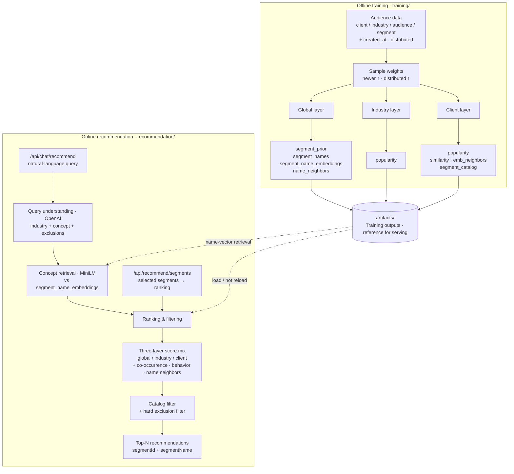

# Architecture

Segment recommendation has two halves: **offline training** and **online serving**. Training writes artifacts once; the recommendation service loads them as reference data for ranking and chat.

---

## Offline training

| Step | What it does |
|------|----------------|
| Audience data | Rows of `client_name`, `industry`, `audience_id`, `segment_id`, plus optional `created_at` / `distributed` |
| Sample weights | Recency decay × distributed multiplier |
| Global | Platform prior + segment name graph (MiniLM embeddings / neighbors) |
| Industry | Per-industry popularity |
| Client | Private co-occurrence, behavior neighbors, and catalog whitelist |

Outputs land under `artifacts/` (see [`ARTIFACTS.md`](ARTIFACTS.md)).

---

## Artifacts as serving reference

| Artifact | Used for |
|----------|----------|
| `clients/.../segment_catalog.json` | Only recommend segments the client is allowed to use |
| `clients/.../similarity.json` | “Often selected together” |
| `clients/.../emb_neighbors.json` | Behavior-pattern neighbors |
| `global/name_neighbors.json` | Semantic name synonyms (e.g. miss ↔ female) |
| `global/segment_name_embeddings.json` | Chat: concept text → seed segments |
| `global/segment_names.json` | Human-readable `segmentName` in API responses |
| `global/segment_prior.json` + industry / client popularity | Cold-start and popularity channels |

Reload after retrain: `POST /api/admin/reload`.

---

## Online recommendation

### Structured API

`POST /api/recommend/segments` — client + optional industry / selected segment IDs → fused ranking → catalog (+ optional expand) → Top-N.

### Chat API

`POST /api/chat/recommend`:

1. **Query understanding** (OpenAI by default) → `industry`, `concept`, `excludeConcepts`
2. **Concept retrieval** — embed concept with MiniLM, cosine against `segment_name_embeddings`
3. **Ranking** — same as structured API, using seeds as selected segments
4. **Hard filters** — catalog + exclusion terms (e.g. “no males”)

Details: [`QUERY_UNDERSTANDING.md`](QUERY_UNDERSTANDING.md), [`TENANCY.md`](TENANCY.md).

---

## Related docs

- [`ARTIFACTS.md`](ARTIFACTS.md) — file-level dictionary
- [`ALGORITHMS.md`](ALGORITHMS.md) — training algorithms
- [`TENANCY.md`](TENANCY.md) — three-layer isolation
- [`NAME_SIMILARITY.md`](NAME_SIMILARITY.md) — MiniLM name neighbors
- [`SAMPLE_WEIGHTS.md`](SAMPLE_WEIGHTS.md) — recency / distributed weights
- [`QUERY_UNDERSTANDING.md`](QUERY_UNDERSTANDING.md) — OpenAI query parse
